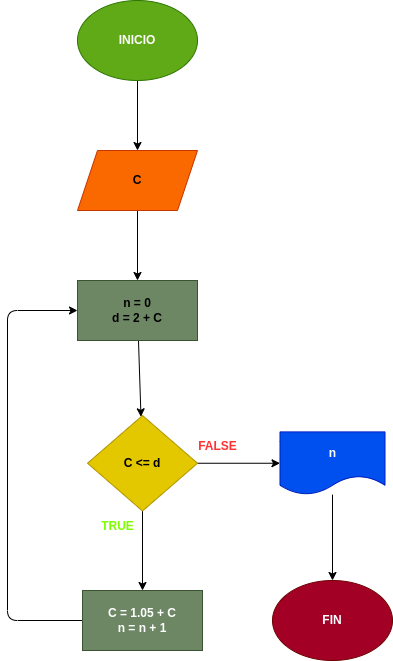

# Tres_Compuestos

hacer el diagrama de flujo y el programa en python, que lea un capital C,  y que averigue e imprima  en cuantos meses se duplica si lo colocamos a un interes compuesto del 5% mensual

---

# Analisis

Variables de entrada (imput)

- C : el dinero que ingresamos al banco

Variables de proceso y salida (Prossesing, storage and Output)

- n : los meses que transcurriran despues de ingresar el dinero

- d : lo que ara que se le sume un 5% mensual al dinero que ingresamos

---

# Diseño

